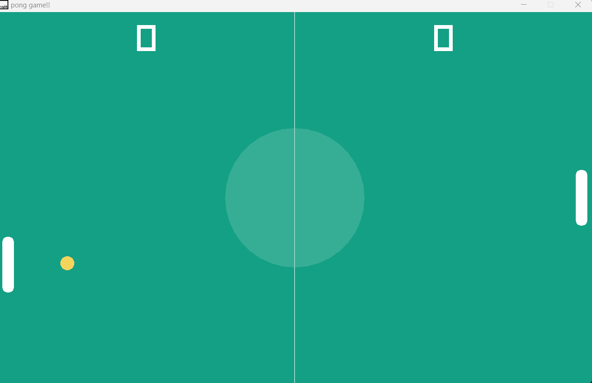

# Pong Game



**Pong Game** is a classic two-player arcade game implemented in C++ using the [Raylib](https://www.raylib.com/) library. It features a simple bot for single-player mode and provides hours of fun and nostalgia.

## Table of Contents

- [Features](#features)
- [Getting Started](#getting-started)
- [How to Play](#how-to-play)
- [Contributing](#contributing)
- [License](#license)

## Features

- Classic Pong gameplay.
- Single-player mode with a responsive bot.
- Easy-to-use keyboard controls.
- Score tracking for both players.
- Minimalist and appealing graphics.
- Responsive and smooth gameplay.


## Getting Started

These instructions will help you get a copy of the project up and running on your local machine for development and testing purposes.

1. Clone the repository:

   ```bash
   git clone https://github.com/yourusername/pong-game.git
   ```

2. Build the game:

   Just open the project in vscode and press F5.

3. Run the game:

   ```bash
   ./main
   ```
   or

   just double chick on main.exe.

## How to Play

- Player 1 (right paddle) uses the **UP ARROW KEY** and **DOWN ARROW KEY** keys to move up and down, respectively.
- In single-player mode, the bot controls Player 2 (left paddle).
- You can also pause the game by using the **SPACE KEY** .

## Contributing

Contributions are welcome! Feel free to open issues or pull requests for any bug fixes, enhancements, or new features.

1. Fork the repository.
2. Create your feature branch: `git checkout -b feature/new-feature`.
3. Commit your changes: `git commit -m 'Add some new feature'`.
4. Push to your branch: `git push origin feature/new-feature`.
5. Create a new pull request.


Enjoy playing Pong and have fun coding!

For questions or feedback, contact [prasahnt2002pd](prashant2002singh915@gmail.com).
